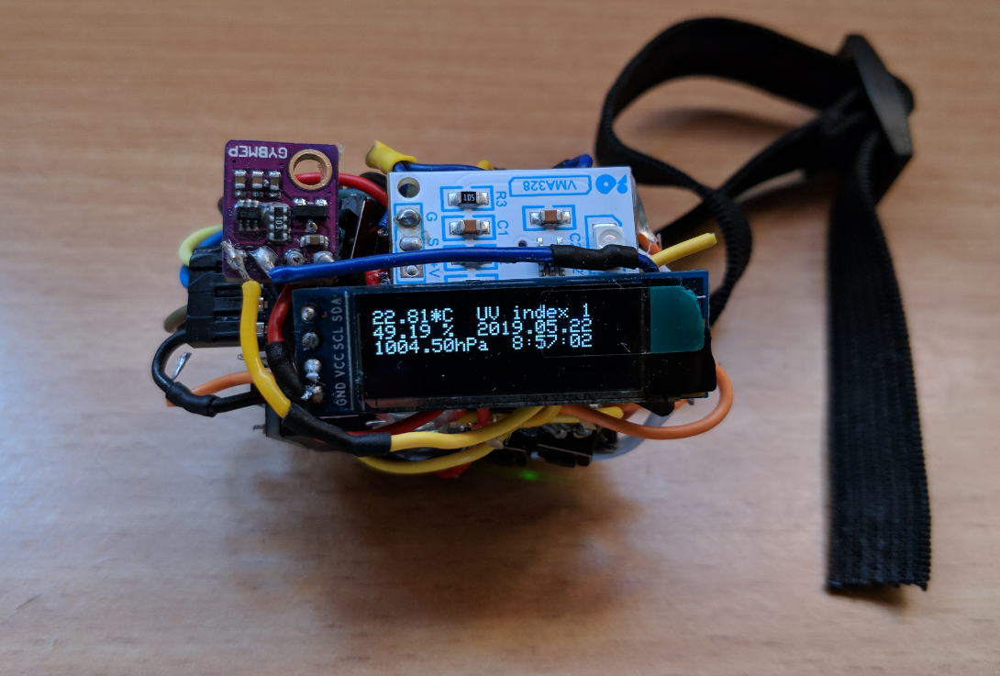
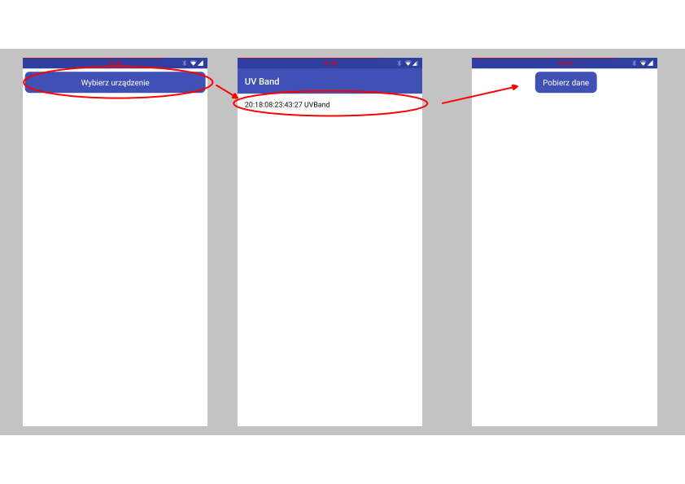
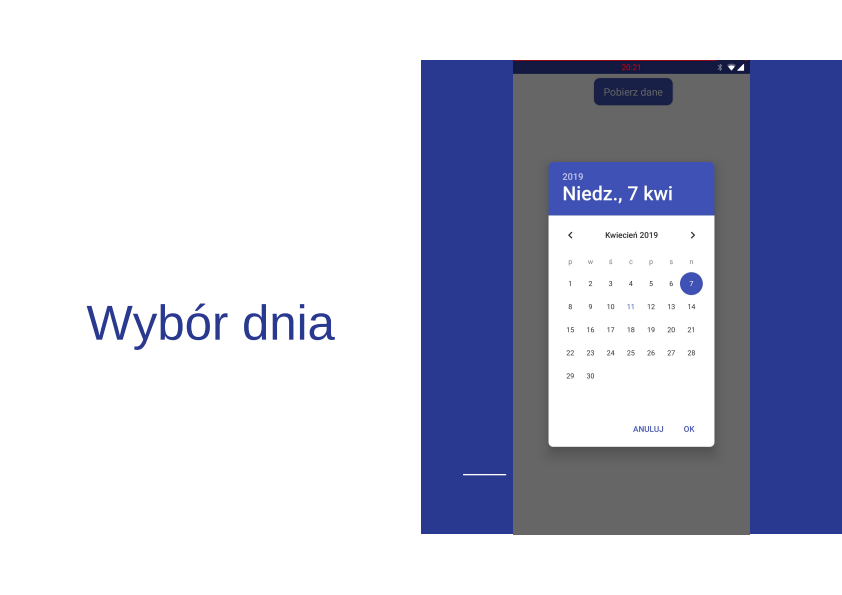
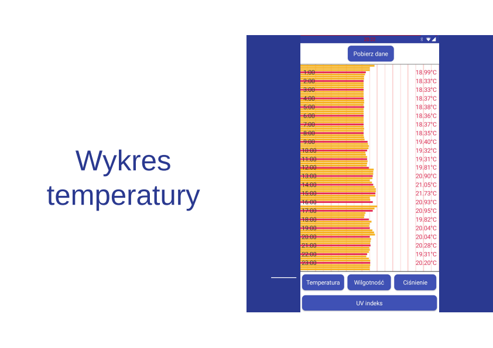
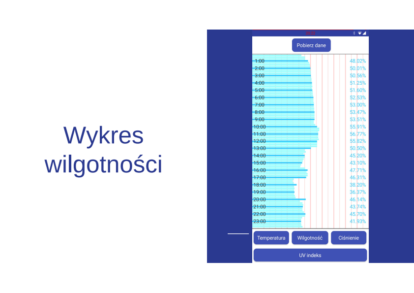
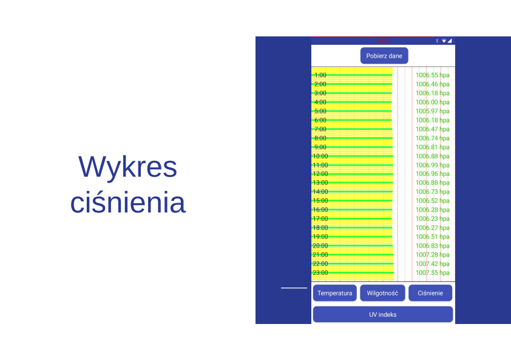
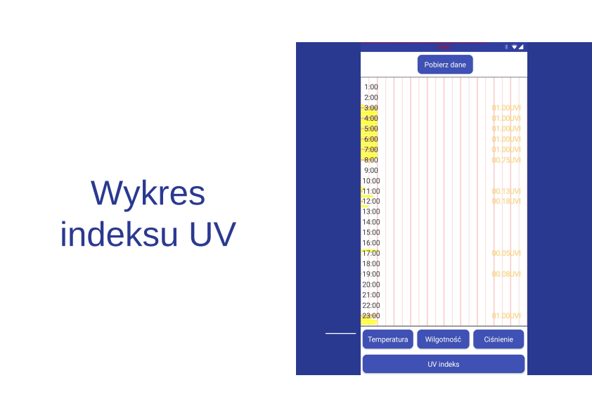

# uv-band (May 2019)
Arduino based uv level detection wristband. School project.

# Hardware
- Microcontroller - Arduino Pro Mini 328
- UV sensor - UV GUVA - S12SD
- Humidity, temeperature and pressure sensor - Adafruit BME280
- Pulse sensor - DFRobot Gravity
- Generic Micro SD adapter with SPI interface
- Monochrome OLED Display - DFRobot DFR0647
- Bluetooth module - HM10 
- Real-time clock - RTC DS3231 I2C
- Two THT butons
- Vibration motor 10x2,7mm - 3V
- Lipol charger TP4056 1S 3,7V
- Li-Pol cell

# Android app
The application was made in the online tool - App Inventor.
## Device selection

## Data download process

## Data presentation
### Temperature diagram

### Humitity diagram

### Pressure diagram

### UV index diagram

# Arduino sketch dependencies
List of required libraries. Since the project was completed five years ago as of the writing this file I will verify them as soon as I have access to the hardware.
- SSD1306Ascii
- Adafruit GFX Library
- Adafruit BME280 Library
- LowPower_LowePowerLab
